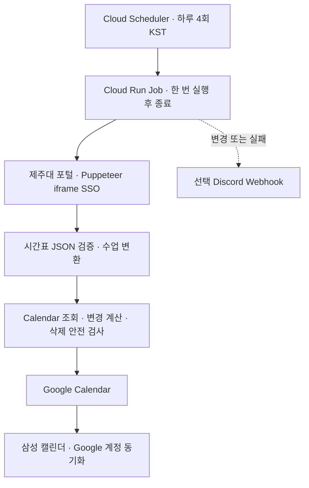

# 제주대학교 시간표 → Google Calendar

제주대학교 포털의 개인 시간표를 Google Calendar로 자동 동기화하는 개인용 도구입니다.

**처음 설치하는 사용자라면 → [한국어 설치 가이드](./USER_GUIDE_KO.md)**

Fork부터 Cloud Shell 배포, Calendar 공유, 첫 실행, 삼성 캘린더, 선택 Discord 알림까지 순서대로 설명합니다.

## 기능과 실행 구조

- 한국 시간 기준 현재 학기 전체를 자동 조회하므로 START/END를 수정하지 않습니다.
- 수업·휴강·보강·강의실·시간·온라인 상태 변경과 연강 병합을 반영합니다.
- 결정적 이벤트 ID와 관리 marker로 중복을 방지하고 사용자 생성 일정은 보존합니다.
- 비정상적인 빈 응답·급감 시 Calendar 변경을 중단합니다.
- Discord는 변경 또는 실패 때만 알리며, 알림 장애는 동기화 결과에 영향을 주지 않습니다.



Cloud Run Job은 상시 서버 없이 종료되는 작업에 맞습니다. 기본 설정은 CPU 1, 메모리 1 GiB, task 1, 병렬 1, timeout 600초, 플랫폼 재시도 0입니다. Scheduler는 `17 8,12,16,20 * * *`, `Asia/Seoul`을 사용합니다. API 재시도는 애플리케이션 안에서 제한하며 추가 DB는 없습니다. [공식 예약 실행 안내](https://docs.cloud.google.com/run/docs/execute/jobs-on-schedule)

## 데이터 처리와 안전성

`portalClient.ts`는 숨김 iframe과 SSO 스크립트를 사용하는 기존 브라우저 인증을 유지합니다. 네트워크 idle 대신 인증된 `/index.htm` 문서 조건을 기다리고, 로그인 거부 대화상자는 즉시 실패로 처리합니다. HTTP 전용 인증은 실제 계정으로 재현이 검증되지 않아 도입하지 않았습니다. 브라우저는 finally에서 닫습니다.

조회 범위는 봄 3월 1일~8월 31일, 가을 9월 1일~다음 해 2월 말이며 시작일 이전 7일을 포함합니다. KST 기준 자동 전환이며 학교 학사일정 API에서 개강일을 얻는 방식은 아닙니다. 포털 시간표에 포함된 시험도 조회되지만 강의계획서나 별도 학사일정의 시험을 수집하지는 않습니다.

응답은 classTables 배열과 날짜·시간·휴강 상태를 검증합니다. HTML, 누락 필드, 잘못된 시간은 빈 배열로 대체하지 않습니다. 검증 실패 시 Calendar 쓰기는 없습니다.

Calendar는 `extendedProperties.private.managedBy=jnu-google-calendar-sync`와 sourceKey의 해시로 만든 ID를 사용합니다. 동일 범위에 완전히 포함되는 관리 일정만 비교하며, upsert가 끝난 후 stale 관리 일정을 삭제합니다. 학기 전체와 아직 종료되지 않은 수업에 각각 빈 결과/급감 검사를 적용합니다. 기존 일정이 있는데 새 일정이 0개이거나, 5개 이상 줄고 절반 미만이 되면 **모든 Calendar 쓰기 전에 중단**합니다. 과거 일정이 미래 수업 소실을 가리지 않도록 합니다.

## 인증과 설정

Cloud Run은 전용 서비스 계정의 ADC를 사용합니다. Calendar scope가 있는 단기 토큰은 IAM Credentials를 통해 자기 서비스 계정을 impersonate하여 얻습니다. 런타임 계정 자체에만 Token Creator를 부여하고, 해당 Calendar에 일정 변경 권한을 공유합니다. JSON private key는 만들지 않습니다. [Cloud Run 서비스 ID](https://docs.cloud.google.com/run/docs/securing/service-identity)

| 설정 | 용도 |
| --- | --- |
| PORTAL_USERNAME | 필수, Secret Manager의 포털 아이디 |
| PORTAL_PASSWORD | 필수, Secret Manager의 포털 비밀번호 |
| GOOGLE_CALENDAR_ID | 필수, 사용자가 선택한 전용 캘린더 ID |
| DISCORD_WEBHOOK_URL | 선택, Secret Manager. 없으면 알림 비활성화 |
| CALENDAR_SERVICE_ACCOUNT | 배포 스크립트가 지정하는 런타임 계정 이메일 |

로컬에서는 `.env.example`을 참고하여 `.env.local`에 설정하고 별도로 적절한 scope의 ADC를 준비합니다. 일반 사용자 설치는 Cloud Shell 가이드를 사용하세요. Cloud Run에 GOOGLE_APPLICATION_CREDENTIALS나 JSON 키를 설정하지 마세요. Secret, 쿠키, 토큰, Webhook URL을 Git이나 로그에 기록하지 않습니다.

## 저장소 구조

| 경로 | 역할 |
| --- | --- |
| src/dateRange.ts | KST 자동 학기 범위 |
| src/portalClient.ts, src/response.ts | 브라우저 인증·조회와 엄격한 응답 검증 |
| src/iCalConverter.ts, src/googleEvents.ts | 수업 상태·연강 병합·Calendar 이벤트 변환 |
| src/googleAuth.ts, src/googleCalendar.ts | ADC 단기 토큰, diff/upsert, 삭제 보호 |
| src/sync.ts, src/index.ts | 단계별 로그, 알림 연계, 1회 실행·종료 |
| src/notify.ts, src/retry.ts | 선택 Webhook, 제한된 재시도 |
| src/tests/ | 외부 계정 없는 회귀 테스트 |
| scripts/deploy.sh, scripts/schedule.sh | 초기 설정·배포와 Scheduler 갱신 |
| Dockerfile, .github/workflows/test.yml | 운영 이미지 및 CI |

## 로컬 개발과 검증

Node.js 22.12 이상, pnpm 9.7.1이 필요합니다.

```bash
pnpm install --frozen-lockfile
pnpm test
pnpm typecheck
pnpm build
pnpm sync
```

sync는 실제 계정 설정이 있을 때 Calendar를 변경합니다. 테스트는 계정과 네트워크 없이 실행합니다. start와 sync는 같은 1회 실행 경로입니다. 실패는 exit 1, 성공은 exit 0이며 애플리케이션 전체 제한시간은 540초입니다.

CI는 테스트·타입 검사·빌드·shell 문법과 Docker 이미지, 설정 누락 시 비정상 종료, Chrome 실행, 네트워크 idle이 되지 않는 iframe 로그인 fixture를 검증합니다. GitHub Actions 예약 동기화는 제거했습니다.

## 배포와 운영

[사용자 가이드](./USER_GUIDE_KO.md)의 deploy.sh로 API, 최소 IAM, Secret Manager와 Cloud Run Job을 설정합니다. 수동 실행 두 번을 검증한 후 schedule.sh를 실행합니다. 코드만 재배포하는 절차도 가이드 13절에 있습니다. 배포 스크립트는 기존 자원을 삭제하지 않으며 secret의 특정 숫자 버전을 연결합니다.

## 알려진 제한

- 실제 포털의 추가 인증이나 화면 변경은 코드·계정 조치가 필요할 수 있습니다.
- 정상적인 대규모 수강 취소도 안전장치가 차단할 수 있어 포털 대조 후 해당 일정의 수동 정리가 필요합니다.
- Calendar 여러 쓰기는 트랜잭션이 아닙니다. 중간 실패 시 일부 변경이 남고 다음 실행이 다시 비교합니다.
- 수동 실행끼리 중복 실행하지 마세요. 별도 분산 잠금이나 DB는 없습니다.
- 삼성 캘린더 표시·동기화 지연은 기기의 Google 계정 설정에 따릅니다.
- 상시 인스턴스는 없지만 무료를 보장하지 않습니다. 최신 가격과 준비물은 사용자 가이드를 확인하세요.

[변경 기록](./update.md) · [라이선스](./LICENSE)