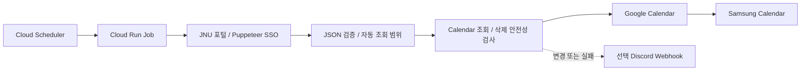

# JNU Google Calendar

제주대학교 포털 시간표를 Google Calendar에 동기화하는 개인용 도구입니다.

**처음 설치하는 사용자라면 → [한국어 설치 가이드](./USER_GUIDE_KO.md)**

## 기능과 실행 구조

휴강·보강·온라인 수업·강의실/시간 변경을 반영하고 연강을 병합합니다. 같은 원본은 결정적 ID로 중복 생성을 막습니다. Samsung Calendar에서는 같은 Google 계정으로 결과를 볼 수 있습니다.



Job은 한 번 동기화하고 종료합니다. 상시 서버·DB 없이 한국 시간 08:17, 12:17, 16:17, 20:17에 실행합니다. GitHub Actions는 테스트와 컨테이너 검증만 수행합니다.

## 데이터 흐름과 안전성

1. 실행 시작 시 Asia/Seoul의 오늘을 한 번 계산합니다. 지난 7일의 정정과 향후 42일의 수업을 조회합니다. 가까운 휴강/보강을 반영하면서 무제한 학기 전체 조회를 피하는 기본값입니다. 학기마다 바꿀 설정은 없습니다.
2. 공개 로그인 페이지(2026-09-07 확인)는 hidden iframe에 POST하고 JavaScript SSO를 실행합니다. HTTP만으로 인증 성공을 재현하지 못했으므로 Puppeteer를 유지합니다. networkidle 대신 /index.htm의 로그인 입력창 부재를 기다린 후 실제 시간표 JSON을 검증합니다.
3. 필수 필드·날짜·시각·요청 범위를 검증합니다. HTML, 부분 스키마, 시간 누락을 빈 시간표로 변환하지 않습니다.
4. Calendar에서 같은 범위의 managed event를 모두 읽습니다. 마커를 재확인하고 경계에 걸친 일정과 범위 밖 일정은 제외합니다.
5. 기존 일정이 있는데 대체 이벤트가 0개면 중단합니다. 5개 이상 감소하면서 기존 수의 절반 미만이 되어도 **쓰기 전에** 중단합니다. 두 쪽 모두 0개이면 정상입니다. 학기 종료로 과거 일정이 범위 밖으로 빠지는 것은 감소에 포함하지 않습니다.
6. 변경을 upsert한 뒤 stale managed event를 삭제합니다. upsert 실패 시 삭제 단계로 넘어가지 않습니다. 단, Calendar API에는 전체 작업 트랜잭션이 없으므로 중간 실패 시 일부 upsert는 이미 반영될 수 있습니다. 다음 성공 실행이 다시 계산합니다.

기존 `extendedProperties.private.managedBy=jnu-google-calendar-sync`와 SHA-256 기반 ID를 유지합니다. sourceKey는 기존처럼 과목·상태·강사·장소·시작/종료시각으로 구성됩니다. 시간/장소 변경은 새 ID 생성 후 이전 ID 삭제로 처리되어 최종 결과를 맞춥니다. ID 알고리즘을 바꾸지 않아 기존 일정과의 호환성을 유지합니다. Google이 UTC로 반환한 시각도 같은 순간이면 변경으로 보지 않습니다.

## 인증과 권한

JSON 개인 키 없이 Google 공식 라이브러리의 ADC를 사용합니다. 배포 스크립트가 지정한 `CALENDAR_SERVICE_ACCOUNT`로 IAM Credentials의 단기 Calendar 토큰을 발급합니다. Calendar 호출에는 `calendar.events` 범위가 필요하므로 Cloud 플랫폼 토큰만을 Calendar에 전달하지 않습니다.

| 계정 | 권한 |
| --- | --- |
| jnu-calendar 런타임 | 해당 포털/선택 Discord secret에만 Secret Accessor, 자기 서비스 계정 리소스에만 Token Creator |
| jnu-scheduler | 해당 Job에만 Cloud Run Invoker |
| Cloud Build 기본 계정 | 소스 빌드용 프로젝트 Cloud Run Builder |
| Calendar 공유 | 런타임 이메일에 **일정 변경** 권한 |

런타임에는 Editor/Owner를 주지 않습니다. `GOOGLE_APPLICATION_CREDENTIALS`를 Cloud Run에 설정하지 않고 키 파일을 이미지에 넣지 않습니다. [서비스 ID](https://docs.cloud.google.com/run/docs/securing/service-identity), [단기 인증](https://docs.cloud.google.com/iam/docs/create-short-lived-credentials-direct), [공식 인증 라이브러리](https://github.com/googleapis/google-auth-library-nodejs)를 참고하세요.

## 코드 구조

| 경로 | 역할 |
| --- | --- |
| src/index.ts, src/sync.ts | 1회 실행, 상태 코드, 안전한 단계별 로그 |
| src/dateRange.ts | 순수 함수로 KST 조회 범위 계산 |
| src/portalClient.ts, src/response.ts | SSO, 재시도, 엄격한 응답 검사 |
| src/iCalConverter.ts, src/googleEvents.ts | 기존 수업 변환·병합과 이벤트 생성 |
| src/googleCalendar.ts, src/googleAuth.ts | diff, 삭제 차단, ADC/단기 토큰 |
| src/notify.ts | 선택 Webhook, 실패 격리 |
| src/tests/ | 네트워크와 계정 없이 실행하는 회귀 테스트 |
| scripts/deploy.sh, scripts/schedule.sh | Cloud Shell 배포와 스케줄 |
| Dockerfile | Node 22, 버전이 맞는 Chrome, 비루트 실행, tini |

## 설정

| 값 | 필수 | 저장 위치 |
| --- | --- | --- |
| PORTAL_USERNAME | 예 | Secret Manager |
| PORTAL_PASSWORD | 예 | Secret Manager |
| GOOGLE_CALENDAR_ID | 예 | Job 환경변수 |
| DISCORD_WEBHOOK_URL | 아니요 | Secret Manager |
| CALENDAR_SERVICE_ACCOUNT | 배포 시 자동 | Job 환경변수, 비밀 아님 |
| Project ID / Region | 배포 때 | 스크립트 인자 |

START_YYYYMMDD, END_YYYYMMDD, SYNC_INTERVAL_HOURS, Google private key 설정은 제거했습니다.

Discord URL이 없으면 네트워크 요청도 없습니다. 변경 없을 때는 조용히 끝나며, 변경 수나 실패 단계만 전송합니다. Webhook 실패는 Calendar 성공/실패 결과를 바꾸지 않습니다. 메시지에 강의명·계정·원문 오류를 넣지 않습니다.

## 로컬 개발

Node.js 22 이상과 pnpm 9.7.1을 사용합니다.

```bash
pnpm install --frozen-lockfile
pnpm test
pnpm typecheck
pnpm build
```

테스트에는 실제 계정이 필요 없습니다. 실제 로컬 동기화는 .env.example을 .env.local로 복사하여 값을 채우고 ADC를 준비한 뒤 `pnpm sync`를 실행합니다. 실제 캘린더에 쓰므로 개발용 캘린더를 사용하세요. `pnpm start`도 같은 1회 실행입니다.

운영과 같은 계정으로 로컬 실행하려면 관리자가 개발자에게 대상 서비스 계정의 Token Creator를 부여하고, `gcloud auth application-default login` 후 .env.local에 CALENDAR_SERVICE_ACCOUNT를 넣습니다. 개발자 권한은 런타임의 자기 자신에 대한 권한과 별개입니다. 자세한 [로컬 ADC](https://docs.cloud.google.com/docs/authentication/set-up-adc-local-dev)를 참고하세요.

```bash
docker build -t jnu-calendar .
```

CI는 타입/테스트/빌드, Bash 문법, 이미지 빌드, Chrome 시작과 무설정 실패 종료를 검사합니다.

## 배포와 운영 제한

[설치 가이드](./USER_GUIDE_KO.md)대로 Cloud Shell에서 deploy.sh를 실행합니다. 기존 Job을 업데이트하며 자원을 무조건 삭제하지 않습니다. secret은 숫자 버전에 고정하고 재배포 때 갱신합니다. 첫 검증 이후 schedule.sh가 같은 이름의 Scheduler를 생성/갱신합니다.

- 포털 인증 성공과 Google Calendar 실제 쓰기는 개인 계정으로 첫 실행 확인이 필요합니다. 공개 로그인 폼 조사만으로 SSO 성공을 보장하지 않습니다.
- 조회는 향후 6주까지만 표시하며 그보다 먼 일정은 시기가 가까워지면 추가됩니다. 과거 7일 이전 정정은 반영하지 않습니다.
- 진짜 전체 휴강/대규모 수강 변경도 안전장치가 막을 수 있습니다. 포털 확인 후 전용 캘린더에서 해당 일정만 수동 정리하고 재실행합니다. 자동 차단 해제 스위치는 제공하지 않습니다.
- 작은 부분 누락은 현재 두 데이터만으로 완벽히 감지할 수 없습니다. DB 없이 보수적 감소 차단을 적용한 범위입니다.
- 작업 전체 9분, Cloud Run 10분 제한, 포털 단계 30초, Calendar 요청 20초, Discord 10초입니다. 일시 네트워크/429/5xx만 제한 재시도합니다.
- 여러 Job 실행을 동시에 시작하지 마세요. task 수 1은 서로 다른 execution 간의 잠금이 아닙니다. Scheduler 중복 전달이나 수동 중복 실행을 완전히 막는 분산 잠금은 없습니다.
- 설정 변경이나 새 버전 수신은 재배포해야 합니다. 포털 시간표 변경은 자동 반영됩니다.
- .env/키/Webhook/쿠키를 커밋하거나 원문 transport 오류를 출력하지 않습니다. 컨테이너와 Cloud Build 업로드는 허용 파일만 포함합니다.

상시 인스턴스 없이 하루 네 번만 실행하므로 사용량을 낮게 유지합니다. 무료를 보장하지 않습니다. [Cloud Run 가격](https://cloud.google.com/run/pricing), [Scheduler 가격](https://cloud.google.com/scheduler/pricing), [Secret Manager 가격](https://cloud.google.com/secret-manager/pricing), [Cloud Build 가격](https://cloud.google.com/build/pricing), [Artifact Registry 가격](https://cloud.google.com/artifact-registry/pricing)을 확인하세요.

[라이선스](./LICENSE)
